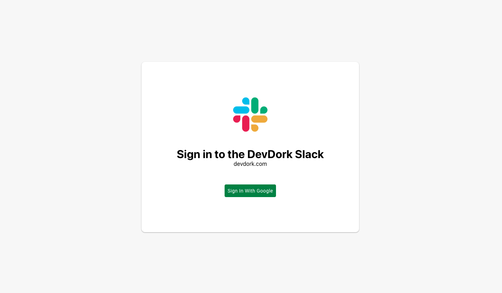
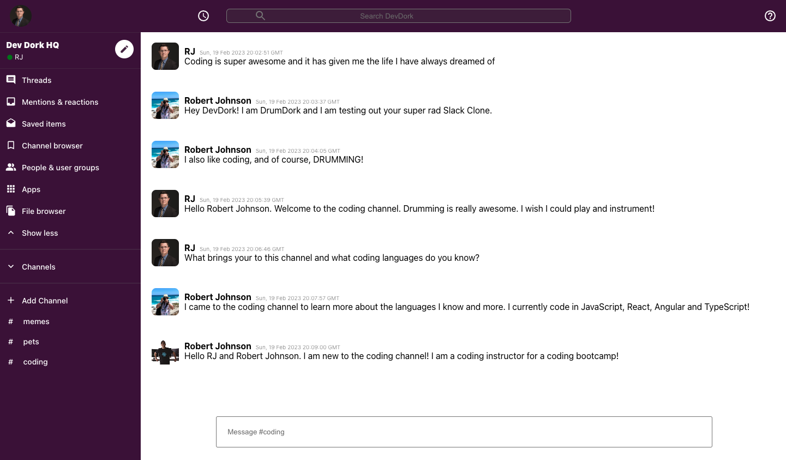

 <h1 align="center"><a href="https://mern-react-book.herokuapp.com/"> Full Stack Slack Clone 📱</a></h1>

## Description

  Full Stack App - Slack Clone built with React, Redux, Styled Components & Firebase Hooks functionality and user authentication via gmail deployed to Firebase.

  [](https://github.com/johnsonr84)
  [](https://github.com/johnsonr84/react-book-search)
  [](https://github.com/johnsonr84/react-book-search)
  [](https://choosealicense.com/licenses/mit/)

## Built With

  [](https://reactjs.org/)

## Table of Contents

* [Description](#description)
* [Project URL](#project-url)
* [Deployment](#deployment)
* [Demo/Screenshots](#Demo/Screenshots)
* [Installation](#installation)
* [Usage](#usage)
* [Credits](#credits)
* [License](#license)
* [Resources](#resources)
* [Contact](#contact)
* [Author](#author)

## Project URL

  <https://github.com/johnsonr84/slack-clone>

## Deployment

  <https://slack-clone-dd-71ab5.web.app/>

## Demo/Screenshots

  <table>
    <tr>
      <td>slack clone login</td>
    </tr>
        <tr>
      <td></td>
    </tr>
    <tr>
      <td>slack clone app</td>
    </tr>
    <tr>
      <td></td>
    </tr>
  </table>

## Technologies

  ```
  React, Firebase, Styled Components, React-Router-Dom
  ```

## Installation

   Access to GitHub.com and a code editor such as vscode is necessary. Click the GitHub link provided above to the APP REPO. Click on the green button that says Clone or Download and Choose how you would like to download: using the SSH/HTTPS keys or download the zip file. If using SSH/HTTPS Key: You will copy the link shown and open up either terminal (mac: pre-installed) or gitbash (pc: must be installed). Once the application is open, you will type git clone paste url here. If using Download ZIP: Click on Download Zip. Locate the file and double click it to unzip the file. Locate the unzipped folder and open it.

## Usage

  In the project directory, you can run:

### `npm start`

Runs the app in the development mode.\
Open [http://localhost:3000](http://localhost:3000) to view it in your browser.

The page will reload when you make changes.\
You may also see any lint errors in the console.

### `npm test`

Launches the test runner in the interactive watch mode.\
See the section about [running tests](https://facebook.github.io/create-react-app/docs/running-tests) for more information.

### `npm run build`

Builds the app for production to the `build` folder.\
It correctly bundles React in production mode and optimizes the build for the best performance.

The build is minified and the filenames include the hashes.\
Your app is ready to be deployed!

See the section about [deployment](https://facebook.github.io/create-react-app/docs/deployment) for more information.

### `npm run eject`

**Note: this is a one-way operation. Once you `eject`, you can't go back!**

If you aren't satisfied with the build tool and configuration choices, you can `eject` at any time. This command will remove the single build dependency from your project.

Instead, it will copy all the configuration files and the transitive dependencies (webpack, Babel, ESLint, etc) right into your project so you have full control over them. All of the commands except `eject` will still work, but they will point to the copied scripts so you can tweak them. At this point you're on your own.

You don't have to ever use `eject`. The curated feature set is suitable for small and middle deployments, and you shouldn't feel obligated to use this feature. However we understand that this tool wouldn't be useful if you couldn't customize it when you are ready for it.

## Credits

  Sonny Sangha live tutorial on youtube see resources below

## License

  This project is [mit](https://choosealicense.com/licenses/mit/) licensed.

## Features

  Coming soon maybe

## Tests

  npm test

## Resources

* [Choose a License](https://choosealicense.com/)
* [YouTube](https://www.youtube.com/watch?v=QiTq5WrWoJw)
* [Next.js](https://nextjs.org/)
* [Redux](https://redux.js.org/)

## Contact

  Email: robertcjohnson1984@gmail.com

## Author

  Author(s): Rob Johnson  

  GitHub: <https://github.com/johnsonr84/>
